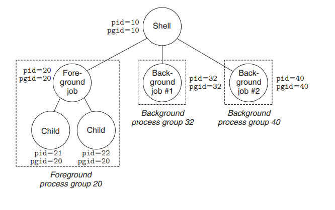

Max jobs: seems like we will need a bounds checking for fork 

Need some signal handlers for states

Enviorn points to process's enviorment

Are built in commands foreground only??

Foreground or pathname 
Fork 

ctrl-c (ctrl-z) foreground and descendents
by sending signal to entire foreground process group using -PID instead of PID, to the KILL function

./sdriver.pl -t trace01.txt -s ./tshref -a "-p"

Wuntraced, when foreground process gets stopped -> send to background. VIA SIGTSTP

Should I terminate stopped child?

Double wait is dangerous 

In eval, the parent must use sigprocmask to block SIGCHLD signals before it forks the child,
and then unblock these signals, again using sigprocmask after it adds the child to the job list by
calling addjob. Since children inherit the blocked vectors of their parents, the child must be sure
to then unblock SIGCHLD signals before it execs the new program.
6
The parent needs to block the SIGCHLD signals in this way in order to avoid the race condition where
the child is reaped by sigchld handler (and thus removed from the job list) before the parent
calls addjob.

We expect you to have good comments (5 pts) and to check the return value of EVERY system call (5 pts).

For good comments I will refer to the textbook format

EVERY system call needs comment 

Do i have to worry about cleanup on quit

