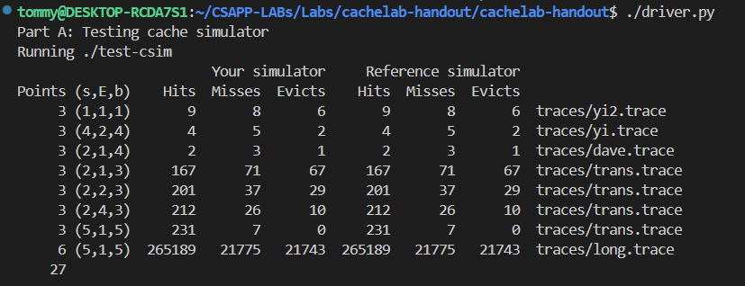
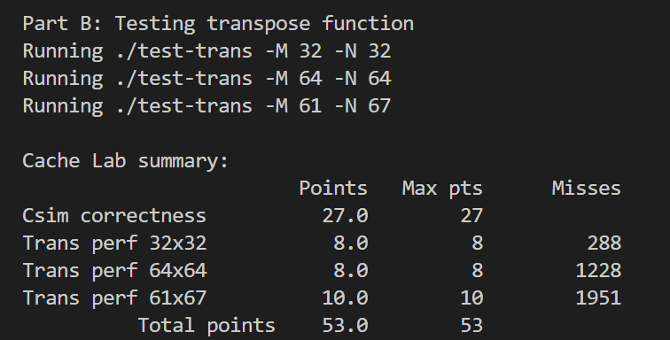

# Cache Lab

In this lab, the student works on two C files called csim.c and
trans.c.  
There are two parts: 
- Part (a) involves implementing a cache
simulator in csim.c. 
- Part (b) involves writing a function that
computes the transpose of a given matrix in trans.c, with the goal of
minimizing the number of misses on a simulated cache.

# Part A: Writing a Cache Simulator 

The Cache Simulator takes a *valgrind* memory trace as input,simulates the hit/miss behavior of a cache memory on this trace, and outputs the total number of hits,
misses, and evictions.

The Cache is a small, fast memory that holds copies of data from larger, slower backing store, exploiting temporal and spatial locality to reduce average access latency. 

Structurally it's parameterized by (S, E, B): S = 2^s sets, E lines per set, B = 2^b bytes per block. An m-bit address splits into tag (t bits), set index (s bits), and block offset (b bits). Total capacity C = S × E × B. E determines associativity: E=1 is direct-mapped, E>1 is set-associative, one set with all lines is fully associative.

On access, the set index selects a set, tags are compared in parallel against the valid lines, and a match with valid=1 is a hit. Misses come in three flavors: compulsory (cold, first reference to a block), conflict (multiple blocks map to the same set and evict each other despite capacity remaining), and capacity (working set exceeds C). Direct-mapped caches suffer conflict misses that fully associative ones of the same size avoid, at the cost of comparator and lookup complexity.

## Implementation

[`csim.c`](../../Labs/cachelab-handout/cachelab-handout/csim.c) — set-associative cache simulator (S/E/B configurable).

## Result

Passes all eight test cases for full credit (27/27). Hit, miss, and eviction counts match the reference simulator exactly across every parameter configuration.

# Part B 

This part requires transposing an N×M matrix into its M×N form while minimizing the number of misses incurred against a simulated direct-mapped cache.

## Constraints

The transpose runs against a fixed cache: **s = 5, E = 1, b = 5**. That means 2^5 = 32 sets, one line per set (direct-mapped), and 2^5 = 32 bytes per block. Each block holds 32 / 4 = **8 ints**, and the whole cache holds 32 × 32 = 1024 bytes = **256 ints (8 full rows of a 32-wide matrix)**. Because E = 1, any two addresses whose set indices collide evict each other immediately — there is no associativity to absorb conflicts.

Two consequences drive the whole solution:

- **The source and destination alias.** `A[i][j]` and `B[j][i]` often land in the same set, so reading from `A` can evict the block of `B` you are about to write (and vice versa). The diagonal blocks are the worst case for this.
- **Only 256 ints fit at once.** For the 32×32 case, rows that are 8 apart map to the same set, so naive row-by-row access thrashes.

The other hard rule: the function may use **at most 12 local variables** (no arrays, no recursion, no helper-function workarounds for storage). This is just enough to hold a handful of loop indices plus the 8 ints of a single block, which is exactly the technique used to break the A/B aliasing on the diagonal: read a full block out of `A` into locals, then write it into `B`, so the read and write phases never fight over the same cache line.

The standard approach is **blocking**: process the matrix in sub-tiles sized to the cache (8×8 for the 32×32 case, with a 4×4 / mixed scheme for 64×64 where only 4 rows fit per set before aliasing), copying via local variables to avoid evicting a block before it is fully consumed.

## My Method

**32×32 and 64×64 (the blocking cases):** In both I tile the matrix into 8×8 blocks and stage data through 8 local registers (`t0`–`t7`) so that I read a full cache line out of `A` and write it into `B` without the two arrays evicting each other mid-block. For 32×32 a plain 8×8 copy is enough, since 8 rows span exactly the cache's 256-int capacity and each `A` block stays resident while it is transposed. For 64×64 I still block by 8×8, but a straight transpose within the block fails because a 64-wide row means rows only 4 apart collide in the same set, so I split each block into 4×4 quadrants and run a three-step pass: first I read the top half of `A` and write the top-left quadrant straight into `B`, while *staging* the top-right quadrant's data into the wrong-but-cached top-right corner of `B`; then I come back, read that staged data out of `B` into registers and pull in `A`'s bottom-left quadrant at the same time, writing both into their correct final positions; finally I transpose the bottom-right quadrant normally. The staging step is the trick, as it parks data in a still-cached part of `B` so I never have to re-read a line of `A` that's already been evicted by aliasing.

**61×67 (the prime case):** Here the boundaries can't be blocked cleanly, but they don't need to be. Because 61 and 67 are prime (and not multiples of 8 or aligned to the set count), successive rows don't wrap onto the same set the way the power-of-two dimensions do; the row stride no longer maps consecutive rows onto identical set indices, so the pathological conflict misses that plague 32×32 and 64×64 simply don't occur. A coarse, simple block (17×17 tiles) therefore lands under the miss threshold with no special-casing.

## Implementation

[`trans.c`](../../Labs/cachelab-handout/cachelab-handout/trans.c) — blocked matrix transpose (8×8 tiling for 32×32, 4×4 quadrant staging for 64×64, 17×17 tiles for 61×67).

